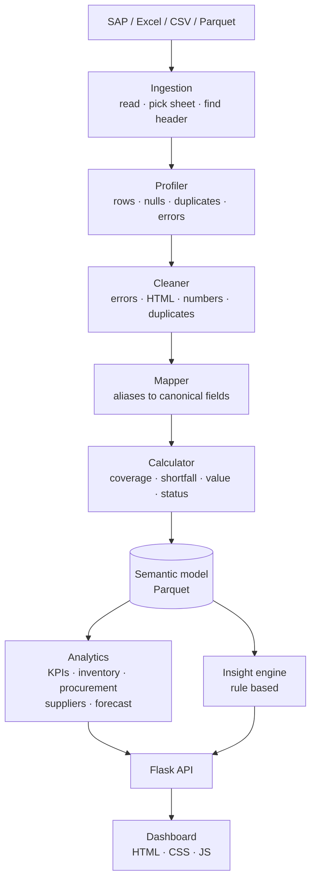
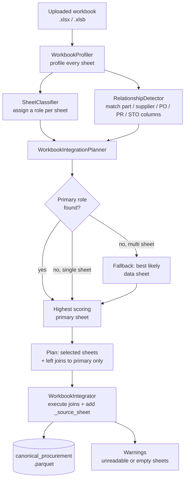
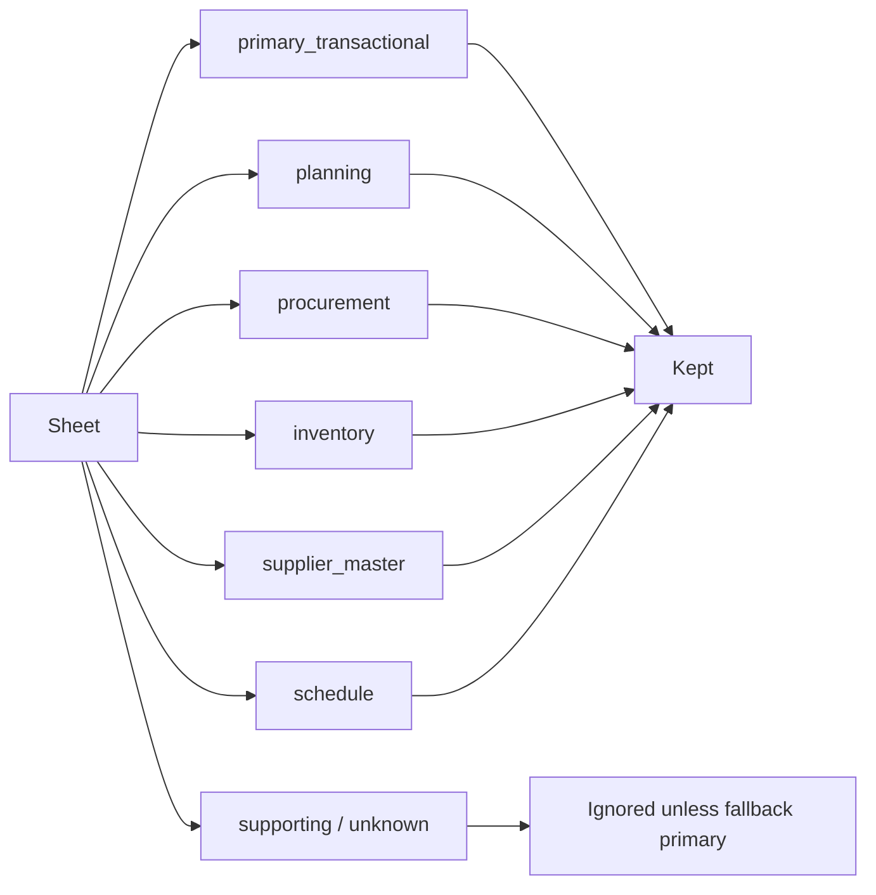
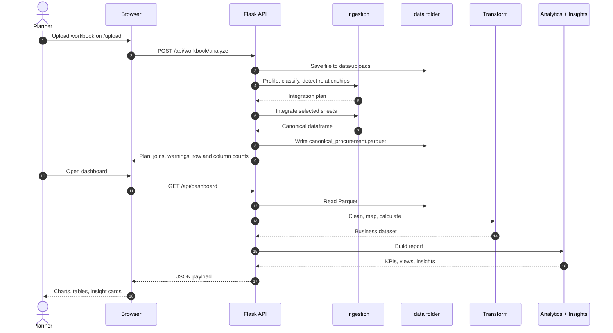
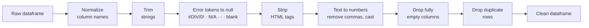
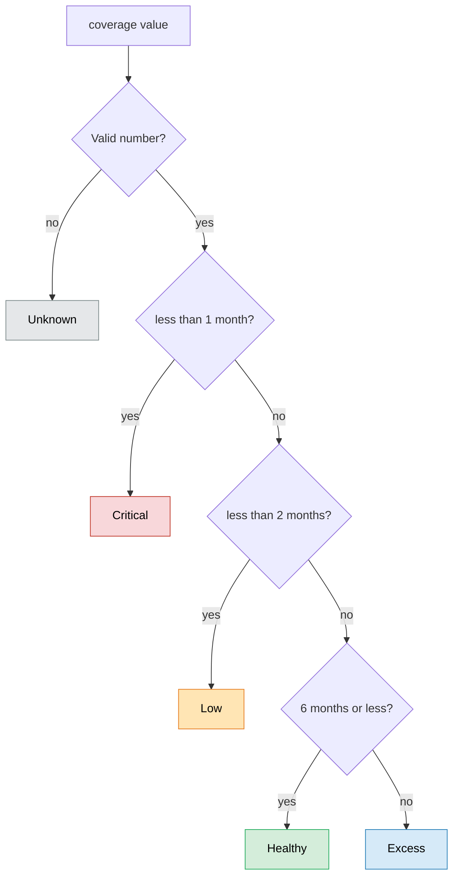
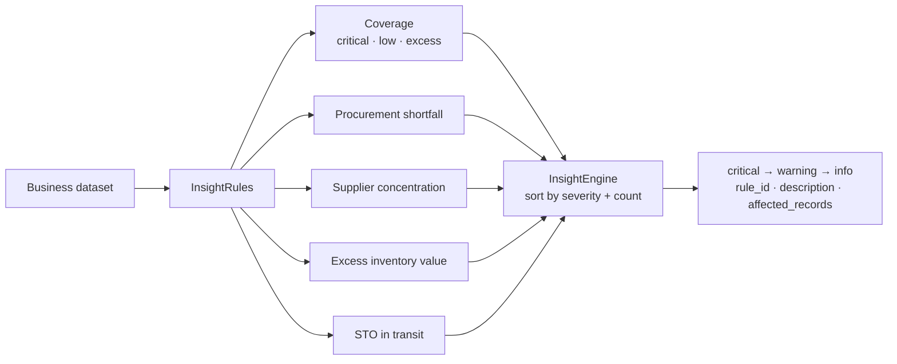
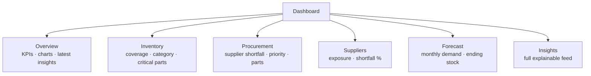
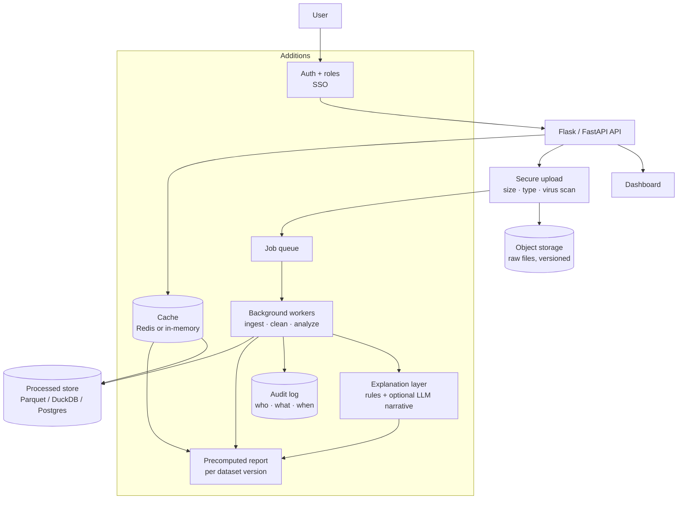
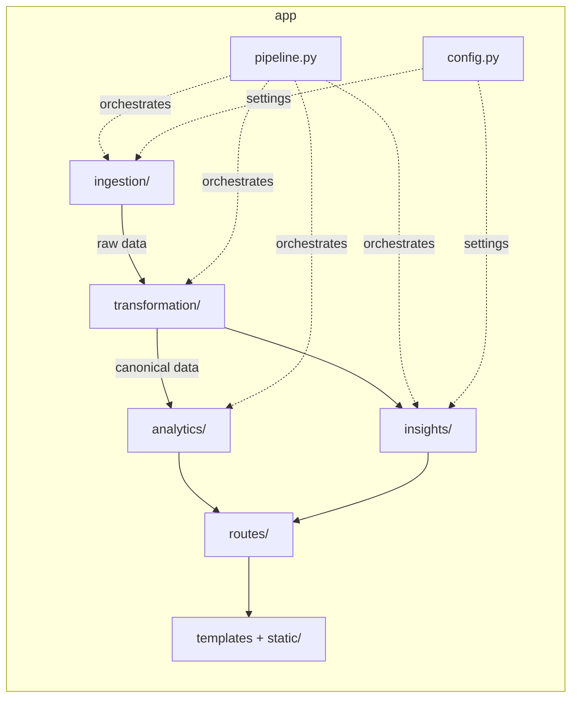

# Diagrams — SAP PPC Data Intelligence

> All diagrams use [Mermaid](https://mermaid.js.org/). They render automatically on GitHub, GitLab, VS Code (Markdown Preview Mermaid Support extension), Obsidian and Notion. If your viewer shows raw code, paste the block into <https://mermaid.live>.

---

## 1. System overview (current)

---

## 2. Multi-sheet workbook intelligence

How one messy workbook becomes one clean dataset.

**Sheet roles**

---

## 3. Sequence: upload to dashboard

---

## 4. Data cleaning flow

---

## 5. Coverage status decision

---

## 6. Insight engine

---

## 7. Dashboard map

---

## 8. Proposed future architecture

Target state with caching, background jobs, storage and security. Items in the dashed group are additions; see `04_FUTURE_SCOPE.md`.

---

## 9. Folder-to-layer map (for quick reference)

---

*Related docs: `01_PROJECT_EXPLANATION.md` · `02_ARCHITECTURE.md` · `04_FUTURE_SCOPE.md`*